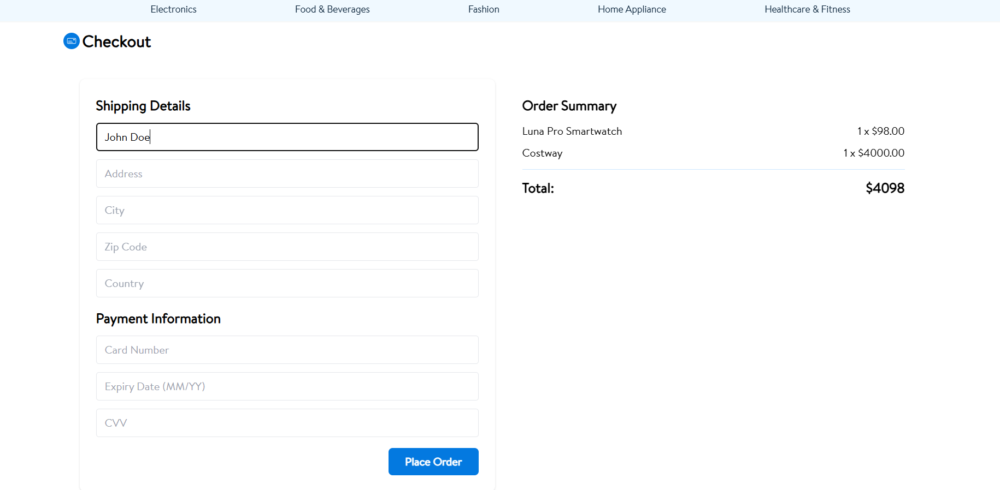

# MyStore: Ecommerce platform
MyStore is an eCommerce platform built with Laravel (backend) and Next.js (frontend). It offers a seamless shopping experience and an intuitive admin dashboard to manage products, orders, users, roles, permissions and view analytics. Perfect for businesses of all sizes, MyStore combines performance, security, and flexibility.
# Previews
1. Landing page


2. Home Page


3. Product detail page


4. Cart


5. Checkout page


6. Admin Dashboard


7. Product Management


8. Add Product Page


# 👉🏽 [Live Demo](https://mystore-a0s0.onrender.com/)

##  Setup & Installation

Follow these steps to get **MyStore** up and running locally.

### 1. Clone the repository
```bash
git clone https://github.com/natnael0024/Ecommerce.git
cd Ecommerce
cd laravel_api
cp .env.example .env
```
* Open .env and update database credentials, e.g.:
```bash
# DB_DATABASE=your_db
# DB_USERNAME=your_user
# DB_PASSWORD=your_password
```

### 2. Set up the backend (Laravel API)
```bash
composer install
php artisan key:generate
php artisan migrate
php artisan db:seed   # if seeders are included
php artisan serve
```
### 3. Set up the frontend (Next.js client)
```bash
cd ../client
cp .env.local.example .env.local
# Update environment variables if needed, for example:
# NEXT_PUBLIC_API_URL=http://127.0.0.1:8000

npm install
npm run dev
```
The frontend will be available at http://localhost:3000


